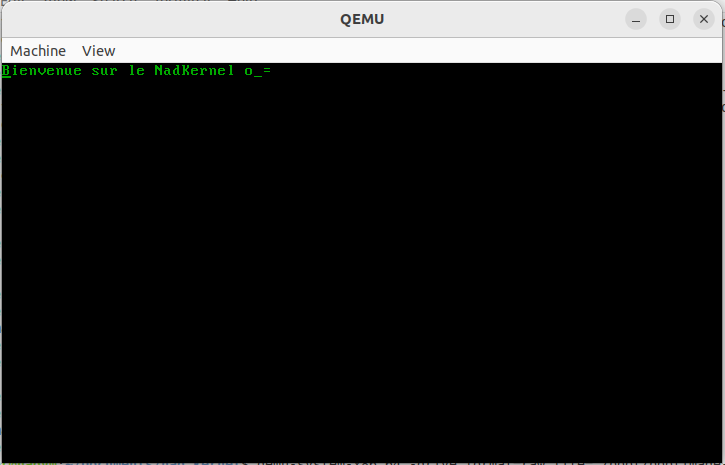

# Rust Hello world from boot
## A simple program which can run on boot for x64_86 architecture

- It learned me how I could run a program from boot without an operating system

## Next goals

- [ ] Make a self-made bootloader for Armv8

- [ ] Boot my "operating system" on my Raspberry pi 4

---------------
### I followed this course to learn how to build and run this program 
- https://os.phil-opp.com/

----------------

To compile the code you need to

```
$ cargo build
$ cargo install bootimage
$ cargo bootimage
```

`Or you can simply download the file from ./demo folder`

After that, you can run the ./target/x86_64-nad_on-boot/debug/bootimag-nad_on-boot.bin file with QEMU, KVM or what you want

There is the command for QEMU:
```
$ qemu-syste-x86_64 -drive format=raw,file=./bootimage-nad_on-boot.bin
```


